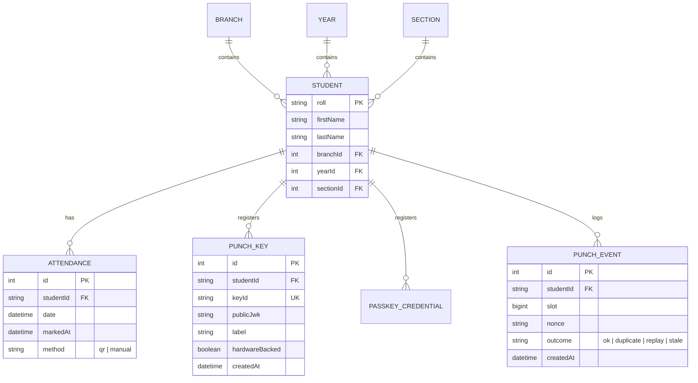

# 🎓 Welcome to the QR-Attendance-System & PunchOS!
### Complete Developer Onboarding & Architectural Guide for New Engineers

Welcome to the team! 🎉 If you just joined this project, this guide is written specifically for you. It explains **what the project is**, **why we built it**, **how every piece connects**, and **how you can run, debug, and contribute** to the codebase with complete confidence.

---

## 📌 Table of Contents
1. [The "Elevator Pitch" — What Problem Are We Solving?](#1-the-elevator-pitch--what-problem-are-we-solving)
2. [High-Level Architecture & Concept](#2-high-level-architecture--concept)
3. [The Two Attendance Workflows](#3-the-two-attendance-workflows)
   - [Workflow A: Dynamic Classroom Projection (45s Rotating QR)](#workflow-a-dynamic-classroom-projection-45s-rotating-qr)
   - [Workflow B: Biometric Hardware Punch (3s Mobile Reverse QR)](#workflow-b-biometric-hardware-punch-3s-mobile-reverse-qr)
4. [Monorepo & Directory Structure](#4-monorepo--directory-structure)
5. [Deep Dive into Each Component](#5-deep-dive-into-each-component)
   - [5.1 Backend Server (`/server`)](#51-backend-server-server)
   - [5.2 Protocol SDK (`/protocol`)](#52-protocol-sdk-protocol)
   - [5.3 Faculty Analytics Dashboard (`/dashboard`)](#53-faculty-analytics-dashboard-dashboard)
   - [5.4 Student Punch PWA (`/punch-pwa`)](#54-student-punch-pwa-punch-pwa)
6. [Database Schema & Data Flow](#6-database-schema--data-flow)
7. [Security & Cryptography Explained (Without the Headache)](#7-security--cryptography-explained-without-the-headache)
8. [Real-Time Engine: Server-Sent Events (SSE)](#8-real-time-engine-server-sent-events-sse)
9. [How to Run & Test the Project Locally](#9-how-to-run--test-the-project-locally)
10. [Common Tasks & FAQs for New Developers](#10-common-tasks--faqs-for-new-developers)

---

## 1. The "Elevator Pitch" — What Problem Are We Solving?

Traditional attendance systems in colleges and organizations suffer from two major flaws:
1. **Manual Roll Calls / Paper Sign-in Sheets:** Slow, eats up 10-15 minutes of lecture time, and prone to manual transcription errors.
2. **Simple Static QR Codes:** Students take a photo of the QR code, share it on WhatsApp/Telegram with friends who are sleeping in their dorms, and their friends scan it remotely to get fake attendance (**Buddy Punching / Proxy Attendance**).

### Our Solution:
**PunchOS / QR-Attendance-System** is a full-stack, real-time, anti-proxy attendance platform combining:
- **Rotating HMAC Tokens (45 seconds):** For classroom projection, ensuring tokens expire before they can be forwarded.
- **Biometric Passkey & Hardware-Bound Punch (3 seconds):** The student's smartphone signs an ephemeral attendance token using an ECDSA P-256 private key stored strictly in their phone's **Hardware Secure Enclave / TEE**. The private key never leaves the phone!
- **Real-Time Live Dashboard:** Instant live feed via Server-Sent Events (SSE) with one-click undo.
- **Tamper-Evident Merkle Logs:** Batch cryptographic verification for institutional audits.

---

## 2. High-Level Architecture & Concept

Here is how all 4 packages in our repository interact:

```
+---------------------------------------------------------------------------------------------------------+
|                                              CLIENT LAYER                                               |
|                                                                                                         |
|   +---------------------------------------+                   +---------------------------------------+ |
|   |         Student Smartphone            |                   |       Faculty Kiosk / Laptop          | |
|   |           (punch-pwa:3001)            |                   |          (dashboard:3000)             | |
|   |  - WebAuthn Biometric Enrollment      |                   |  - Live SSE Real-Time Scanner Feed    | |
|   |  - 3s Dynamic ES256 QR Generator      |                   |  - 45s Rotating Projector Screen      | |
|   |  - Personal Attendance Analytics      |                   |  - Merkle Audit & Student Manager     | |
|   +-------------------+-------------------+                   +-------------------+-------------------+ |
+-----------------------|-----------------------------------------------------------|---------------------+
                        |                                                           |
                        | HTTP REST / JWS / WebAuthn                                | HTTP REST / SSE Stream
                        v                                                           v
+---------------------------------------------------------------------------------------------------------+
|                                           BACKEND SERVER                                                |
|                                             (server:8000)                                               |
|                                                                                                         |
|   +-----------------------------+  +-----------------------------+  +--------------------------------+  |
|   |    Express REST Routers     |  |    Punch Protocol Engine    |  |    SSE Event Broadcasting      |  |
|   |  - /api/students            |  |  - ES256 Verify (WebCrypto) |  |  - Real-time client listeners  |  |
|   |  - /api/attendance          |  |  - WebAuthn FIDO2 verify    |  |  - Instant push on scan/undo   |  |
|   |  - /api/stats               |  |  - 3s Slot & Nonce Replay   |  +--------------------------------+  |
|   +-----------------------------+  +-----------------------------+                                      |
|                                                  |                                                      |
|                                                  v                                                      |
|                                    +---------------------------+                                        |
|                                    |    Prisma ORM (SQLite)    |                                        |
|                                    +---------------------------+                                        |
+---------------------------------------------------------------------------------------------------------+
                                                   ^
                                                   | Shared Protocol Types & Cryptography
+--------------------------------------------------+------------------------------------------------------+
|                                          PROTOCOL SDK                                                   |
|                                           (/protocol)                                                   |
|       - Isomorphic ES256 signing/verification (Node.js & WebCrypto)                                     |
|       - Slot mathematics (3-second epoch windows)                                                       |
|       - Merkle Tree generation & cryptographic proofs                                                   |
+---------------------------------------------------------------------------------------------------------+
```

---

## 3. The Two Attendance Workflows

To understand the codebase, you only need to understand these two flows:

### Workflow A: Dynamic Classroom Projection (45s Rotating QR)
1. **Faculty** opens the **Dashboard** (`http://localhost:3000`) and projects the **Classroom Projector** screen on a big display.
2. The server creates an HMAC-SHA256 token encoding the date, time slot, and a rotating secret key.
3. Every **45 seconds**, a new QR code automatically fades in.
4. **Students** in the classroom scan the QR code with their mobile phone cameras.
5. The mobile phone submits the student's Roll Number + Token to `/api/attendance/mark`.
6. If the token is within the valid time window, the server saves the record and fires an SSE event that instantly turns the student's row green on the faculty projector!

### Workflow B: Biometric Hardware Punch (3s Mobile Reverse QR)
This mode is designed for physical kiosks (entry turnstiles) or faculty scanning student phones:
1. **Enrollment (One-Time):**
   - The student opens the PWA (`http://<LAN-IP>:3001`).
   - The student clicks **Enroll Device**.
   - The browser invokes `navigator.credentials.create()` (WebAuthn / Passkeys) or WebCrypto ECDSA P-256.
   - The private key is locked inside the phone's hardware. The public key (JWK) is registered with `/api/punch/enroll/verify`.
2. **Punching (Daily):**
   - The student opens the PWA.
   - Every **3 seconds**, the app constructs a payload `{ v: 1, kid, sid: "punch:inst:ROLL", slot, nonce, iat }` and signs it using their private key (`ES256`).
   - It displays a high-speed dynamic QR code with a circular countdown animation.
3. **Verification:**
   - The faculty or kiosk camera (`PunchScanner.tsx`) reads the QR code.
   - The server verifies:
     - 1. Is the slot valid? (Current slot $\pm 1$ slot tolerance to handle clock drift)
     - 2. Has this nonce already been used? (Replay attack guard)
     - 3. Does the signature match the student's registered public key?
   - If valid, attendance is marked and broadcasted over SSE!

---

## 4. Monorepo & Directory Structure

Here is a map of the repository files:

```text
QR-Attendance-System/
├── package.json               # Root scripts (npm run dev:server, dev:dashboard, dev:pwa)
├── README.md                  # Quick intro & basic run instructions
├── DOCUMENTATION.md           # Extended technical reference
├── ONBOARDING_GUIDE.md        # This guide!
│
├── protocol/                  # 🔐 Shared Cryptographic Library (Isomorphic)
│   ├── src/
│   │   ├── core.ts            # Slot calculations, constants, JWS types, Base64URL helpers
│   │   ├── node.ts            # Node.js crypto implementation (DER conversion, verify)
│   │   ├── web.ts             # Browser WebCrypto API implementation (key generation, signing)
│   │   ├── merkle.ts          # Cryptographic Merkle Tree & audit proof builder
│   │   └── index.ts           # Barrel export
│   ├── tests/                 # Unit tests (Vitest)
│   └── package.json
│
├── server/                    # 🚀 Express + TypeScript Backend (Port 8000)
│   ├── prisma/
│   │   ├── schema.prisma      # Prisma schema (Student, Attendance, PunchKey, etc.)
│   │   ├── migrations/        # Database schema migrations
│   │   └── dev.db             # Local SQLite database file
│   ├── src/
│   │   ├── index.ts           # Server bootstrap, CORS, SSE listener, route mounting
│   │   ├── db.ts              # Prisma Client singleton
│   │   ├── seed.ts            # Database seeder (creates dummy branches, sections, students)
│   │   ├── routes/
│   │   │   ├── students.ts    # Student CRUD & filter queries
│   │   │   ├── attendance.ts  # Mark, undo, clear, export attendance
│   │   │   ├── qr.ts          # 45-second rotating classroom QR generator
│   │   │   ├── punch.ts       # WebAuthn / Passkey / Biometric punch verification engine
│   │   │   └── stats.ts       # Aggregated charts & branch statistics
│   │   └── services/
│   │       ├── qr.ts          # Local IP auto-discovery (UDP probe) & HMAC token signer
│   │       └── events.ts      # Server-Sent Events (SSE) client registry & broadcast()
│   ├── package.json
│   └── tsconfig.json
│
├── dashboard/                 # 📊 Faculty Analytics Dashboard (Next.js - Port 3000)
│   ├── src/
│   │   ├── app/
│   │   │   ├── page.tsx       # Main dashboard page (Live feed, Projector, Scanner, Stats)
│   │   │   ├── layout.tsx     # Global HTML shell & metadata
│   │   │   └── globals.css    # Tailwind CSS v4 styling
│   │   ├── components/
│   │   │   ├── LiveFeed.tsx           # Real-time SSE event listener table with Undo button
│   │   │   ├── PunchScanner.tsx       # Live webcam scanner for reading 3s biometric QR codes
│   │   │   ├── MerkleAuditModal.tsx   # Cryptographic audit modal for verifying attendance trees
│   │   │   ├── StatCards.tsx          # Metric cards (Present, Absent, Rate %, Active sessions)
│   │   │   ├── Charts.tsx             # Recharts visualizations (Daily trends, Branch breakdown)
│   │   │   ├── StudentManager.tsx     # Student database editor with modal CRUD & CSV export
│   │   │   └── OrgModeSwitcher.tsx    # Filter selector (Branch, Year, Section)
│   ├── package.json
│   └── tsconfig.json
│
└── punch-pwa/                 # 📱 Student Biometric PWA (Next.js - Port 3001)
    ├── src/
    │   ├── app/
    │   │   ├── page.tsx       # Tab router (Punch Screen, Enroll Flow, Student Analytics)
    │   │   ├── layout.tsx     # PWA meta tags, viewport, theme color
    │   │   └── globals.css    # Modern dark neon theme styling
    │   ├── components/
    │   │   ├── PunchScreen.tsx        # High-speed 3s dynamic QR generator with countdown circle
    │   │   ├── EnrollFlow.tsx         # Passkey / WebAuthn hardware biometric enrollment wizard
    │   │   └── StudentAnalytics.tsx   # Student personal attendance breakdown & history
    │   └── lib/
    │       ├── api.ts         # PWA HTTP client for calling Express server
    │       └── protocol/      # Embedded protocol client utilities
    ├── package.json
    └── tsconfig.json
```

---

## 5. Deep Dive into Each Component

### 5.1 Backend Server (`/server`)
- **Runtime:** Node.js + Express (TypeScript).
- **Port:** `8000`.
- **Key Responsibilities:**
  1. Detects local network IP automatically via UDP socket binding (`getLocalIp()`), so mobile phones on the same Wi-Fi can connect without manual configuration.
  2. Implements `/api/events` (Server-Sent Events) to push instant notifications whenever attendance is marked or undone.
  3. Verifies both HMAC QR codes (Classroom mode) and ECDSA P-256 signatures (Biometric Punch mode).

### 5.2 Protocol SDK (`/protocol`)
- **Package:** `@punch/protocol`
- **Why it exists:** Provides isomorphic (runs both in Node.js server and Browser PWA) cryptographic functions.
- **Key Files:**
  - `core.ts`: Defines slot calculation (`Math.floor(Date.now() / 1000 / 3)`). Every 3 seconds is a new slot.
  - `node.ts`: Converts raw 64-byte `(r || s)` P-256 signatures to ASN.1 DER format so Node's native `crypto.verify` can check them.
  - `web.ts`: Uses `window.crypto.subtle` inside the student's browser to generate ECDSA P-256 keys and sign punches.
  - `merkle.ts`: Hashes all attendance records into a binary Merkle Tree and computes the Root Hash.

### 5.3 Faculty Analytics Dashboard (`/dashboard`)
- **Framework:** Next.js 16 (App Router) + React 19 + Tailwind CSS.
- **Port:** `3000`.
- **Features:**
  - **Live Projector:** Displays the 45s rotating QR code on class displays.
  - **Kiosk Scanner:** Uses `jsQR` to scan student QR codes from webcam or USB barcode scanners.
  - **SSE Live Stream:** Dynamically appends attendance scans to the UI in real-time without polling.
  - **Analytics:** Visualizes attendance ratios with Recharts.

### 5.4 Student Punch PWA (`/punch-pwa`)
- **Framework:** Next.js 16 (Mobile-First PWA).
- **Port:** `3001`.
- **Features:**
  - Works on Android (Chrome) and iOS (Safari) with PWA installability.
  - Generates non-extractable ECDSA P-256 hardware signatures gated by WebAuthn Passkeys (TouchID / FaceID).
  - **Real-Time Attendance Sync (`StudentAnalytics.tsx`):** Subscribes to backend SSE stream (`/api/events`) with 3s polling fallback. Activity rings, attendance rate, class counts, and streaks update automatically upon scan.
  - **Dynamic 7-Day Habit Heatmap:** Maps Monday through Sunday against actual attendance history (`stats.history`) with indicators for attended, missed, weekend, and upcoming days.
  - **Exam Eligibility Predictor:** Computes buffer margins for 75% cutoff compliance.
  - **Verifiable Merkle Receipts:** Generates zero-knowledge RFC 6962 inclusion proofs (`path`, `index`, `rootHex`).

---

## 6. Database Schema & Data Flow

We use **Prisma ORM** with **SQLite** (or PostgreSQL in production). Here are the models:



> **Crucial Rule:** `Attendance` has a unique constraint on `[studentId, date]`. A student can only be marked present **once per day**.

---

## 7. Security & Cryptography Explained (Without the Headache)

If you're new to cryptography, here is how the security works in simple terms:

| Threat | How We Stop It |
|---|---|
| **Student takes a photo of the classroom QR and WhatsApps it to a friend** | The QR expires in **45 seconds**. By the time the friend opens WhatsApp and scans it, the token is dead (`stale token`). |
| **Student takes a screenshot of their phone's Biometric Punch QR** | The punch QR changes every **3 seconds** and includes an incrementing `slot` and unique `nonce`. If someone re-uses an old QR, the server rejects it as `replay` or `stale`. |
| **Student extracts the private key from their phone to create a punch-bot** | The private key is created with `extractable: false` or inside WebAuthn **Secure Enclave / TPM**. It cannot be exported by JavaScript or malware. |
| **Someone tampers with database attendance records after class** | The system produces a **Merkle Root Hash** of all attendance records at the end of the day. If anyone modifies a record in SQLite, the Merkle root changes, flagging immediate tampering. |

---

## 8. Real-Time Engine: Server-Sent Events (SSE)

Instead of having the dashboard poll the server with `setInterval(() => fetch(...), 1000)` (which wastes battery and CPU), we use **Server-Sent Events (SSE)**.

1. When the Dashboard opens, it connects to:
   ```ts
   const eventSource = new EventSource("http://localhost:8000/api/events");
   ```
2. When any student scans their QR or is marked manually, the server calls:
   ```ts
   broadcast("ATTENDANCE_MARKED", { student, attendance, method });
   ```
3. The server immediately pushes a lightweight JSON packet over the open HTTP stream.
4. The dashboard React state updates instantly ($\approx 10\text{ms}$ latency) with a satisfying sound and green badge!

---

## 9. How to Run & Test the Project Locally

### Prerequisites:
- **Node.js**: v18+ (v20+ recommended)
- **npm**: v9+

### Step-by-Step Setup:

```bash
# 1. Clone the repository and enter the directory
cd "QR-Attendance-System"

# 2. Install all dependencies across all packages
npm install
npm --prefix server install
npm --prefix protocol install
npm --prefix dashboard install
npm --prefix punch-pwa install

# 3. Setup Database & Seed Dummy Data
npm run db:push
npm run seed

# 4. Build the protocol library
npm --prefix protocol run build
```

### Running the Services:

You can start each service in separate terminal tabs:

```bash
# Terminal 1: Backend Server (Port 8000)
npm run dev:server

# Terminal 2: Faculty Dashboard (Port 3000)
npm run dev:dashboard

# Terminal 3: Student Punch PWA (Port 3001)
npm run dev:pwa
```

### Accessing the Applications:
- 📊 **Faculty Dashboard:** Open [http://localhost:3000](http://localhost:3000)
- 📱 **Student Mobile PWA:** Open [http://localhost:3001](http://localhost:3001) (or `http://<YOUR_LOCAL_IP>:3001` on your phone)
- 🚀 **Backend API & Health:** Open [http://localhost:8000/api/health](http://localhost:8000/api/health)

---

## 10. Common Tasks & FAQs for New Developers

### Q: Where do I add a new API route?
Add your new router inside [server/src/routes/](file:///e:/shiva/college/6th%20sem%20mini%20project/QR-Attendance-System/server/src/routes/) and register it in [server/src/index.ts](file:///e:/shiva/college/6th%20sem%20mini%20project/QR-Attendance-System/server/src/index.ts) with `app.use('/api/your-feature', yourRouter)`.

### Q: How do I change the database schema?
1. Edit [server/prisma/schema.prisma](file:///e:/shiva/college/6th%20sem%20mini%20project/QR-Attendance-System/server/prisma/schema.prisma).
2. Run `npm run db:push` in the root (or `npm --prefix server run db:push`).
3. Run `npm run db:generate` to update the TypeScript Prisma Client types.

### Q: How do I broadcast a new live event to the dashboard?
Import `broadcast` from [server/src/services/events.ts](file:///e:/shiva/college/6th%20sem%20mini%20project/QR-Attendance-System/server/src/services/events.ts):
```ts
import { broadcast } from "../services/events.js";

broadcast("CUSTOM_EVENT_NAME", { foo: "bar" });
```
Then listen for `"CUSTOM_EVENT_NAME"` in the dashboard's `LiveFeed.tsx` or `page.tsx`.

### Q: How do I test the protocol cryptography?
Run the Vitest test suite:
```bash
npm run test
```

---

**Welcome aboard! If you have any questions, don't hesitate to check the test cases or ask the team lead.** Happy coding! 🚀
